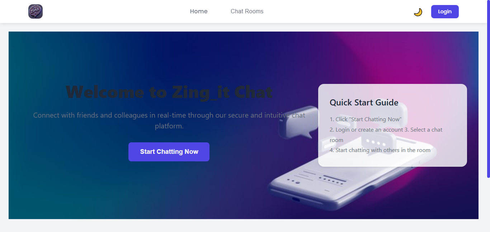
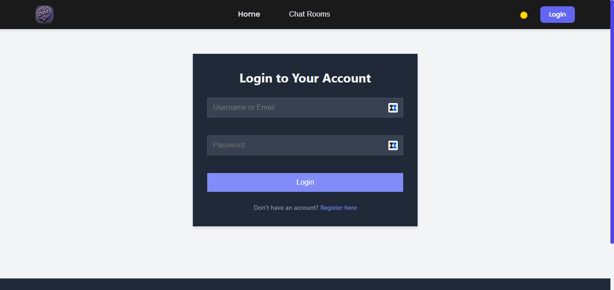
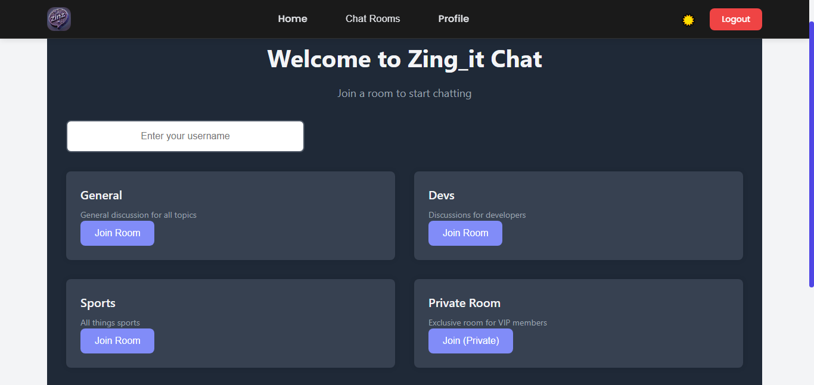
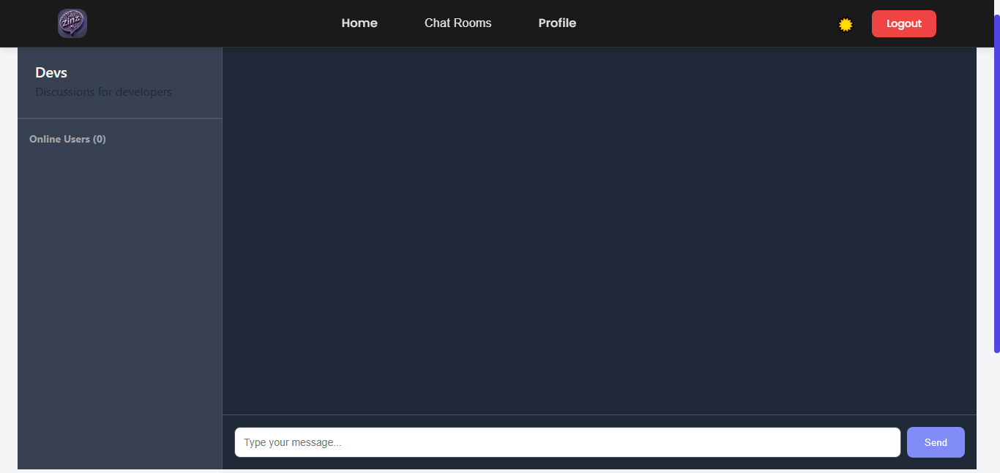

<h1 style="text-align: center;">Zing_It</h1>

|Home Page                                                                     | Login Page                                                                    |
| ---------------------------------------------------------------------------- | ----------------------------------------------------------------------------- |
|   |  |

|Home Page                                                                          | Devs Chat Room                                                     |
| --------------------------------------------------------------------------------- | ------------------------------------------------------------------ |
|  |  |

## Table of Contents

1. [Description](#description)
2. [Features](#features)
3. [Technologies Used](#technologies-used)
4. [Setup Instructions](#setup-instructions)
    - [Prerequisites](#prerequisites)
    - [Installation](#installation)
5. [Contributing](#contributing)
6. [License](#license)
7. [Authors](#authors)

## Description

```text
Zing_it is a real-time chat application that allows users to communicate with each other in real-time
The app is built using a modern stack with real-time WebSocket communication.
```

## Features

```text
- Real-time messaging
- User presence indicator
- Notification sound for new messages
- Dark mode toggle
- Responsive UI (cross-platform support)
- User Friendly Interface
- Message timestamps
```

## Technologies Used

```text
- **Frontend**: React.js, TailwindCSS
- **Backend**: Node.js, Socket.io, Express.js
- **Database**: MongoDB
- **Real-time Communication**: Socket.io
- **Authentication**: JSON Web Tokens
```

## Setup Instructions

### Prerequisites

```text
- Node.js (14.x or higher)
- npm (6.x or higher)
- MongoDB (3.6 or higher) or a MongoDB Atlas Account
```

### Installation

1. Clone the repository: `git clone https://github.com/yourusername/Zing_it.git`
2. Navigate to the project directory: `cd Zing_it`
3. Install dependencies: `npm install`
4. Start the development environment: `npm start`

## Contributing

```text
Pull requests are welcome. For major changes, please open an issue first to discuss what you would like
```

## Authors

- **[GitHub](https://github.com/mwunnam)** , **[X]()**
- Kimotho James **[GitHub](https://github.com/TriggerJames)**, **[X](https://x.com/Jimmiekimotho)**